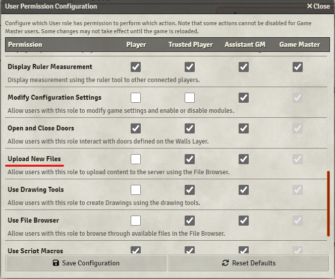

# Chat Media


[](https://forge-vtt.com/bazaar#package=chat-media)


[](https://www.foundryvtt-hub.com/package/chat-media/)


[](https://weblate.foundryvtt-hub.com/engage/chat-media/)

### If you want to buy me a coffee [](https://www.patreon.com/p4535992)

This module adds support for images and partially video in the chat: copy-paste, drag & drop, and links are automatically converted to images.

This is a upgrade of the module [Chat Images](https://github.com/bmarian/chat-images)

## Installation

It's always easiest to install modules from the in game add-on browser.

To install this module manually:
1.  Inside the Foundry "Configuration and Setup" screen, click "Add-on Modules"
2.  Click "Install Module"
3.  In the "Manifest URL" field, paste the following url:
`https://raw.githubusercontent.com/p4535992/foundryvtt-chat-media/master/src/module.json`
4.  Click 'Install' and wait for installation to complete
5.  Don't forget to enable the module in game using the "Manage Module" button

# Features

## Converting an url into an image

If you want to put a image on the chat just put

```
cimage <URL TO IMAGE>
```

```
cvideo <URL TO VIDEO>
```

## Upload image reference from local disk or with Drang and Drop (sadly only for images files)


## Prerequisites

`Upload New Files` permission, if a user doesn't have it, they will get an warning every time they try to upload an image



# Build

## Install all packages

```bash
npm install
```

### dev

`dev` will let you develop you own code with hot reloading on the browser

```bash
npm run dev
```

## npm build scripts

### build

`build` will build and set up a symlink between `dist` and your `dataPath`.

```bash
npm run build
```

### build-watch

`build-watch` will build and watch for changes, rebuilding automatically.

```bash
npm run build-watch
```

### prettier-format

`prettier-format` launch the prettier plugin based on the configuration [here](./.prettierrc)

```bash
npm run-script prettier-format
```

## [Changelog](./CHANGELOG.md)

## Issues

Any issues, bugs, or feature requests are always welcome to be reported directly to the [Issue Tracker](https://github.com/p4535992/environment-interactionenvironment-interaction-multisystem/issues ), or using the [Bug Reporter Module](https://foundryvtt.com/packages/bug-reporter/).

## License

- **[Chat Images](https://github.com/bmarian/chat-images)**: [MIT](https://github.com/bmarian/chat-images/blob/main/LICENSE)
- **[Browser Image Compression](https://github.com/Donaldcwl/browser-image-compression)**: [MIT](https://github.com/Donaldcwl/browser-image-compression/blob/master/LICENSE)

This package is under an [MIT](LICENSE) and the [Foundry Virtual Tabletop Limited License Agreement for module development](https://foundryvtt.com/article/license/).

## Credits

- [bmarian](https://github.com/bmarian) for the module [Chat Images](https://github.com/bmarian/chat-images)

## Acknowledgements

Bootstrapped with League of Extraordinary FoundryVTT Developers [foundry-vtt-types](https://github.com/League-of-Foundry-Developers/foundry-vtt-types).
